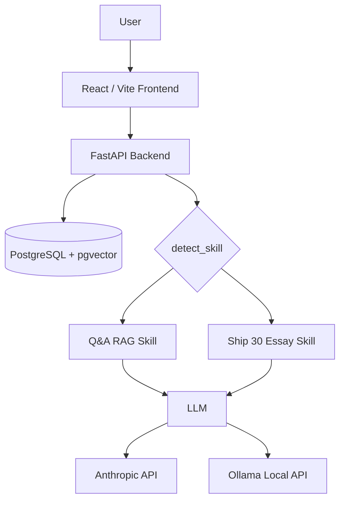
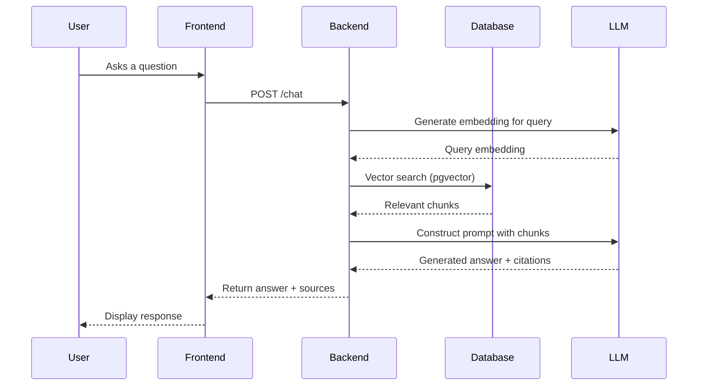

# System Architecture

## Overview

## Database Schema

### `document_chunks`
| Column | Type | Constraints |
|---|---|---|
| id | INT | Primary Key |
| source | VARCHAR | |
| content | TEXT | |
| embedding | VECTOR(384) | |

### `sessions`
| Column | Type | Constraints |
|---|---|---|
| id | VARCHAR | Primary Key |
| created_at | TIMESTAMP | |

### `messages`
| Column | Type | Constraints |
|---|---|---|
| id | INT | Primary Key |
| session_id | VARCHAR | Foreign Key (sessions) |
| role | VARCHAR | |
| content | TEXT | |
| created_at | TIMESTAMP | |

## API Endpoints

| Method | Path | Request Body | Response Body |
|---|---|---|---|
| GET | `/health` | None | `{"status": "ok"}` |
| GET | `/config` | None | `{"llm_provider": "cloud|local"}` |
| POST | `/chat` | `{"session_id": "...", "message": "..."}` | `{"reply": "...", "sources": [...], "artifact": {...}}` |
| POST | `/sessions` | None | `{"session_id": "..."}` |

## Component Boundaries
- **Frontend**: React SPA handling UI state, chat rendering, and artifact viewing. Communicates only with Backend API.
- **Backend API**: FastAPI layer handling HTTP requests, session management, and configuration.
- **Agent Layer**: Logic for routing (`detect_skill`), prompt construction, and interfacing with LLM APIs.
- **Database**: PostgreSQL storing embeddings and chat history.

## Ingestion & Retrieval Flow

## Agent Routing
The `detect_skill` component acts as a router. It evaluates the user's prompt to determine if it fits a specific capability (e.g., "Ship 30 for 30 essay generation"). If a match is found, it routes to that specific prompt template and artifact generation logic. Otherwise, it defaults to the standard Q&A RAG skill.

## Model Toggle
Configured via `LLM_PROVIDER` in `.env`.
- `cloud`: Uses Anthropic Claude via its API.
- `local`: Uses Ollama `phi3` locally.
- **Fallback behavior**: If `local` fails, the system returns an informative error to the user indicating the local provider is unavailable.

## Security Model
- **Artifact rendering**: Rendered in a sandboxed iframe. Attributes: `sandbox="allow-scripts"` but NOT `allow-same-origin`, preventing XSS attacks from accessing the main application state.
- **Input validation**: All incoming data is validated using Pydantic models in FastAPI.
- **Authentication**: No auth implemented; scoped out for this demo.
- **CORS**: Allows all origins (`*`) for demo purposes.

## Deployment Topology
- **PostgreSQL**: Deployed via Docker Compose (`docker-compose.yml`).
- **Backend**: Runs as a local Python process (`uvicorn`).
- **Frontend**: Runs as a local Node process (`npm run dev`).
- **Local LLM**: Runs as a separate Ollama background service if used.
